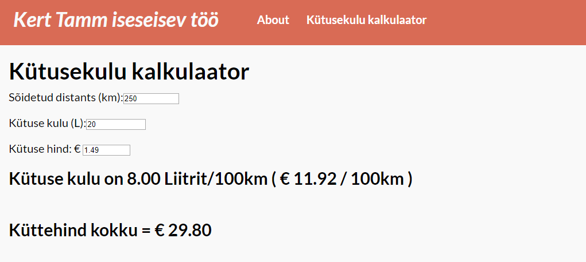
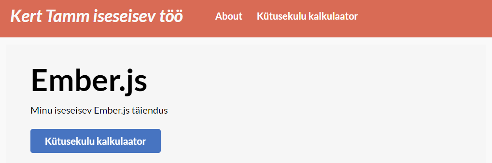
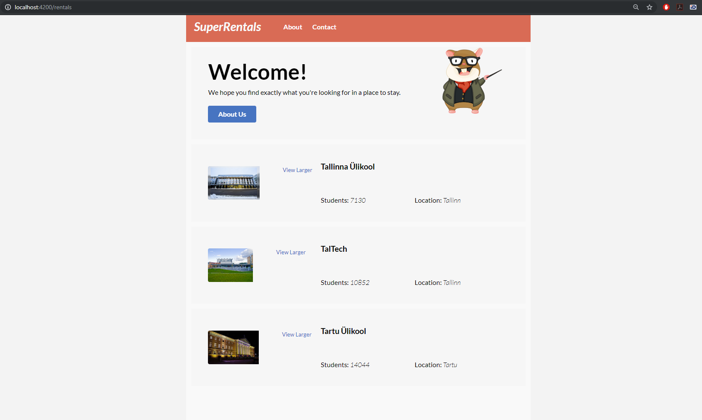

# Kert Tamm Angular Iseseisev Töö

This README outlines the details of collaborating on this Ember application.
A short introduction of this app could easily go here.

## Prerequisites

You will need the following things properly installed on your computer.

* [Git](https://git-scm.com/)
* [Node.js](https://nodejs.org/) (with npm)
* [Ember CLI](https://ember-cli.com/)
* [Google Chrome](https://google.com/chrome/)

## Installation

* `git clone <repository-url>` this repository
* `cd ember-quickstart`
* `npm install`

## Running / Development

* `ember serve`
* Visit your app at [http://localhost:4200](http://localhost:4200).
* Visit your tests at [http://localhost:4200/tests](http://localhost:4200/tests).

### Code Generators

Make use of the many generators for code, try `ember help generate` for more details

### Running Tests

* `ember test`
* `ember test --server`

### Linting

* `npm run lint:hbs`
* `npm run lint:js`
* `npm run lint:js -- --fix`

### Building

* `ember build` (development)
* `ember build --environment production` (production)

### Deploying

Specify what it takes to deploy your app.

## Further Reading / Useful Links

* [ember.js](https://emberjs.com/)
* [ember-cli](https://ember-cli.com/)
* Development Browser Extensions
  * [ember inspector for chrome](https://chrome.google.com/webstore/detail/ember-inspector/bmdblncegkenkacieihfhpjfppoconhi)
  * [ember inspector for firefox](https://addons.mozilla.org/en-US/firefox/addon/ember-inspector/)
  
  
# Ember.js - Kert Tamm tunnis tehtud

GITHUB demo link: https://github.com/rihon/ember

powershell lahti adminina

terminalis:
kontrolliks **npm**, kui näitab et olemas siis edasi

probleemide vältimiseks installida värskeim npm versioon

**npm install npm@latest -g**

**npm install -g ember-cli**

**ember new rentals**

edasi minna rentalite kausta
**cd .\rentals**

**ember serve**

siis edasi kui servitud on avada brauseris

**http://localhost:4200/**

testide jaoks:

**ember g acceptance-test rentals**

siis terminalis code või . code ja otsida üles projekti kaust ning avada VScode’s

siis muutsime **test/acceptance/rentals-test.js** faili ja kirjutasime uusi teste juurde

powershellis:
**ember test --server**

**ember generate route about**

siis peale seda avada **templates/about.hbs**

ja kirjutada sisse kood

**application.hbs** koodist peale outleti muu ära võtta

**ember generate route contact**

siis **contact.hbs** sisse kirjutada kood

**ember generate route rentals**

**ember generate route index**

**ember serve**

kui vaja siis **npm install**

kui puudu olev npm installitud siis saab panna **ember serve**

ja siis avada brauseris **http://localhost:4200/rentals**

edasine õpetus kui ise teha:

siis hakati tegema css installimist terminalis

**ember install ember-cli-tutorial-style**

**ember generate component rental-listing**
